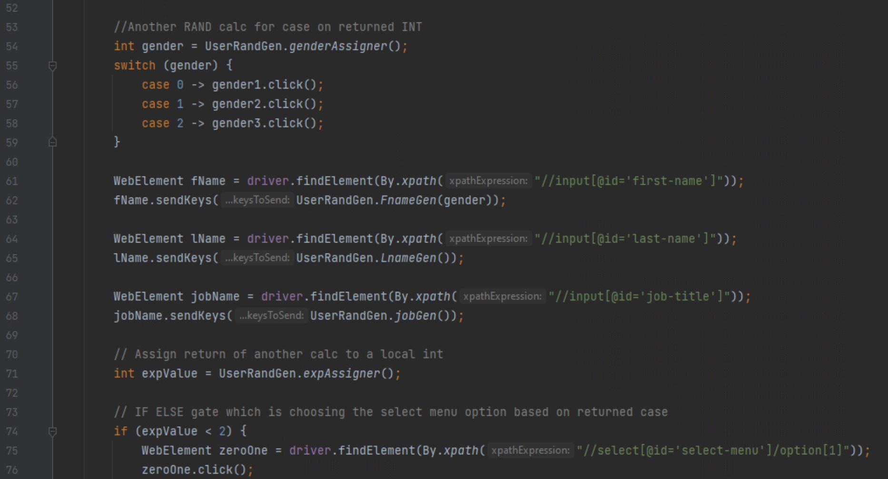

# Nicholas Darcy – Portfolio of Projects
---
## Pleasant-Town: Part One -- Pleasance vs Convienience
### Data Analysis, Algorithm Expression Design

Part of a major hobby project of mine. My goal is to develop a full simulation of a city and it's citizens in order to test and see if certain factors guarentee better success or customer rate based on factors such as aesthetics or accessibility. This was part one, devised via surveys, and includes a potential expression to use for the decision making algorithm. Further parts for this are ongoing, I hope to have this project completed by the end of 2024.

## Medical Jeannie
### Project Management, Agile and Scrum

Major project to upgrade a hypthetical company's data and software solution, purely within the context of an Agile SCRUM enviroment. Mostly helped with designing the API as a SEO for this project, and helped with the Machine Learning strategy.

## Form Test Automation
### Selenium, Automation Testing, Junit, Java

[Click here for the Repo](https://github.com/Darcy-NR/Selenium-Auto-Test)

Realized over the holidays that I had nothing to prove I knew Selenium and that I needed more Java stuff on here so I wrote up some Selenium and JUNIT automated tests with some random generated usernames, and job titles and pointed it to Formy.Heroku for using their dummy forms as a validator. It also has a script to run a Shodan scrape, takes a table and console logs the data in the results table.

## How do you What's New?
### Systems Analysis and Data Analysis.

A project I helped with at with the BA department at Charles Sturt University. I undertook some Systems Analysis roles, meeting with developers, and stakeholders to revitalize an aging legacy web-app the faculty use for bulletin board posting.

It was a pretty indepth experience, culiminating in a wide survey of users, and data analysis of the End-Users to identify user behaviors, posting behaviors, browsing behaviors and help model how the replacement software would have to address these user demographics.

## Serenity (A Powerline Frontend)
### Stack: C# Desktop Frontend for a Python Web API

[Click here for the Repo](https://github.com/Darcy-NR/Serenity)

My current project focus is Serenity, which will be a desktop front-end for the End to End Encrypted Chat App Powerline, maintained by Ben Barber at [this repo.](https://github.com/ComfyTopHat/Powerline)

Powerline runs on a Python API, and the current Android App is running with Kotlin. 

Serenity is largely just a front end executable to run on desktop. It started life as a Laravel Web-app called Outlet but was eventually swapped over to C# after it was concluded a web-app would most likely be unnecessary.
## Fiftybit.chat

### Stack: React Web App running on a PHP Native API, Database with PostGreSQL.

[Click Here for the Repo](https://github.com/Darcy-NR/fiftybit-chat) 

Fiftybit was an experiment I built to build a social media forum aping off a certain website I used a lot as a teenager which was famous (At least at first) for having a totally open API and encouraging users to build custom third party front-ends for it.

The idea was to build a website that was totally agnostic of its stack, which is to say, the forum, its user creation, its login, its posts, its rating system all its functions were built to be usable entirely as JSON input output on the API endpoints. And as an experiment I would call it a complete success.

React and Apache/PHP might seem like a really bizarre stack, and it really was, it would've been way easier to use Node.js and Express to host the API and that would've played much nicer with React JSX. But what I was trying to demonstrate (to myself more than anybody) was that a front-end and a back-end can be completely agnostic of each other and I did this by having two completely separate scripting languages handling both parts of it.

## LoginSystemAlpha

### Stack: Python

[Click Here for the Repo](https://github.com/Darcy-NR/login-system_alpha)

Major project for my Python Certification. Nothing really that impressive just a native python app with a custom UI to handle a prototype login and logout system, writing usernames to a storage JSON and reading dynamically from it.

## E-Trading Post

### Stack: XAMMP

Repo not publicly available

E-Trading post is one of my very oldest projects and is probably the first of my actual dynamic web-apps I built. It's an Ebay/Gumtree platform with user creation, login logout, and posting. Very simple and quite ugly looking but it is an entirely native PHP site using Apache and MySQL/MariaDB
